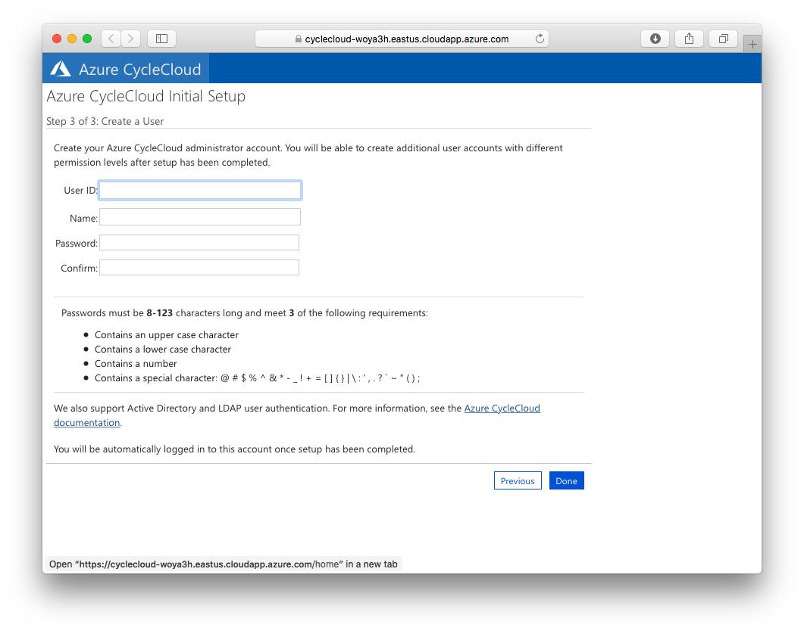
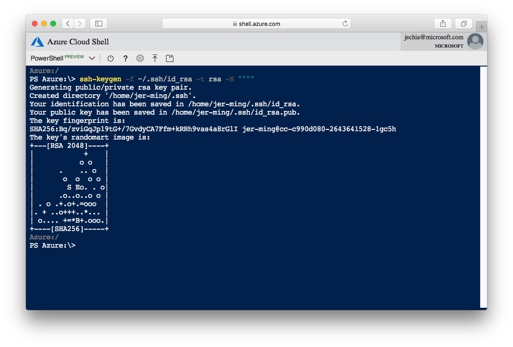

# CycleCloud ARM 
Deploying Azure CycleCloud into a subscription using an Azure Resource Manager template

## Introduction
- This repo contains an ARM template for deploying Azure CycleCloud.
- The template deploys a VNET with 3 separate subnets:

  1. `cycle`: The subnet in which the CycleCloud server is started in.
  2. `compute`: A /22 subnet for the HPC clusters
  3. `user`: The subnet for creating login nodes.

- Provisions a VM in the `cycle` subnet and installs Azure CycleCloud on it.

## Pre-requisites
1. Service Principal
    - Azure CycleCloud requires a service principal with contributor access to your Azure subscription. 

    - The simplest way to create one is using the [Azure CLI in Cloud Shell](https://shell.azure.com), which is already configured with your Azure subscription:
        ```
        $ az ad sp create-for-rbac --name CycleCloudApp --years 1
        {
                "appId": "xxxxxxxx-xxxx-xxxx-xxxx-xxxxxxxxxxxx",
                "displayName": "CycleCloudApp",
                "name": "http://CycleCloudApp",
                "password": "xxxxxxxx-xxxx-xxxx-xxxx-xxxxxxxxxxxx",
                "tenant": "xxxxxxxx-xxxx-xxxx-xxxx-xxxxxxxxxxxx"
        }
        ```
        - Save the output -- you'll need the `appId`, `password` and `tenant`. 

    - Alternatively, follow these [instructions to create a Service Principal](https://docs.microsoft.com/en-us/azure/azure-resource-manager/resource-group-create-service-principal-portal) 
        -  In this case, the authentication key is the `password`

2. An SSH key

    - An SSH key is needed to log into the CycleCloud VM and clusters
    - Specifcy a SSH public key, and that will be used in all CycleCloud Clusters as well as the application server.
    - See [section below](#trouble-with-ssh) for instructions on creating an SSH key if you do not have one.

## Deploying Azure CycleCloud
### From the Azure Portal

[](https://portal.azure.com/#create/Microsoft.Template/uri/https%3A%2F%2Fraw.githubusercontent.com%2FCycleCloudCommunity%2Fcyclecloud_arm%2Fdeploy-azure%2Fazuredeploy.json)

- Click on the button above to deploy Azure Cyclecloud into your subscription. 
- Required Fields:

    - `Tenant Id`: The Tenant ID as listed in the service principal
    - `Application Id`: The Application ID of the service principal
    - `Application Secret`: The Application Password or Authentication Key of the service principal
    - `SSH Public Key`: The public key used to log into the CycleCloud VM
    - `Username`: The username for the CycleCloud VM. We suggest you use your username in the Azure portal, sans domain `@domain.com`


### Using the AZ CLI

* Clone the repo 

        $ git clone https://github.com/CycleCloudCommunity/cyclecloud_arm.git

* Edit and update the parameters in `params.azuredeploy.json`  

* Create a Resource Group, specifying a group name and location:

        $ az group create --name AzureCycleCloud --location ${LOCATION}

* Deploy the template:

        $ az group deployment create --name "azure_cyclecloud_deployment" --resource-group AzureCycleCloud --template-file azuredeploy.json --parameters params.azuredeploy.json

The deployment process runs an installation script as a custom script extension, which installs and sets up CycleCloud. This process takes between 5-8mins

## Login to the CycleCloud application server

* To connect to the CycleCloud webserver, first retrieve the FQDN of the CycleServer VM from the Azure Portal, then browse to https://cycleserverfqdn/. 

_You could also reach the webserver through the VM's public IP address:_

        $ az network public-ip show -g ${RESOURCE-GROUP} -n cycle-ip --query dnsSettings.fqdn

* The first time you access the webserver, the Azure CycleCloud End User License Agreement will be displayed, and you will be prompted to accept it.

* After that, you will be prompted to create an admin user for the application server. For convenience, it is recommended that you use the same username specified in the parameters. 




## Initialize the CycleCloud CLI
* The CycleCloud CLI is required for importing custom cluster templates and projects, and is installed in the **Azure CycleCLoud** VM. 
* To use the CLI, SSH into the VM with the private key that matches the public key supplied in the parameter file. The SSH user is username specified in the parameters.

* Once on the CycleCloud server, initialize the CycleCloud CLI. The username and password are the ones you created and entered in the web UI in the section above.
* 
        $ cyclecloud initialize --batch --url=https://localhost --verify-ssl=false --username=${USERNAME} --password=${PASSWORD}

* Test the CycleCloud CLI

        $ cyclecloud locker list


## Trouble with SSH
- Both Bash and Powershell variants of the Azure Cloud Shell have the SSH client tools installed.
- To generate an ssh-key:


- To obtain the public key of the generated key, run the following command and copy the output:

        PS Azure:\> cat ~/.ssh/id_rsa.pub

- You may also SSH into the VM from Cloud Shell:

       PS Azure:\> ssh username@cyclecloud.fqdn 
